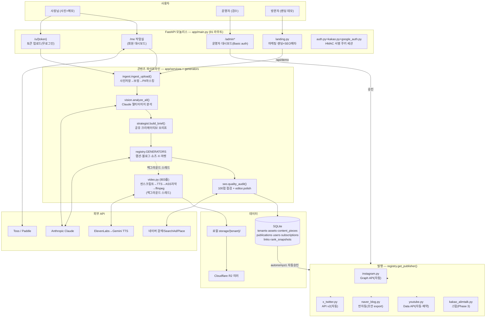

# Shopcast (올린다 · ollinda.kr) — 시스템 아키텍처 (현행 코드 분석)

> 2026-07-11 기준, 실제 코드를 읽고 작성한 현행(as-is) 아키텍처 문서.
> 한 줄 정의: **사진 업로드 → Claude 비전 분석 → 채널별 AI 콘텐츠 생성(인스타·네이버블로그·유튜브쇼츠·X) → SEO 점검 → 검수/자동 발행 → 성과 추적**하는 소상공인용 마케팅 자동화 SaaS.

---

## 0. 기술 스택 요약

| 항목 | 내용 |
|---|---|
| 언어/프레임워크 | Python 3.12 + FastAPI (서버렌더 모놀리스, ~10,300 LOC) |
| 진입점 | `app/main.py` (3,757줄, 91개 라우트) — `uvicorn app.main:app` |
| 프론트엔드 | JS 프레임워크 없음. Python f-string HTML + Tailwind CDN + Pretendard 폰트 |
| DB | SQLite (raw `sqlite3`, ORM 없음) — `app/db.py` (729줄, 13개 테이블) |
| 미디어 스토리지 | 로컬 디스크(원본) + Cloudflare R2 미러(boto3, 선택) |
| AI | Anthropic Claude(비전+텍스트, `claude-opus-4-8`), Gemini(TTS·이미지), ElevenLabs(TTS), Runway(AI영상) |
| 영상 렌더 | ffmpeg subprocess (자막 ASS + TTS + 켄번스 + BGM loudnorm) |
| 배포 | Docker(ffmpeg+fonts-nanum) → Render (starter 플랜, /data 1GB 디스크) |
| 결제 | Toss(국내 정기결제) + Paddle(해외, 웹훅 HMAC 검증) |
| 백그라운드 | `threading.Thread(daemon=True)` fire-and-forget — 큐/스케줄러 없음 |
| 테스트/CI | **없음** (0개) |

모노레포 아님 — 단일 Python 패키지 `app/` 하나가 전부.

---

## 1. 전체 아키텍처 다이어그램



---

## 2. 데이터 흐름: 사용자 요청 → 응답

### 2-1. 콘텐츠 생성 (핵심 경로)

```
POST /u/{token}/upload  또는  /me 업로드            main.py:3381
 │ 즉시 "만드는 중" 페이지 반환(303) — 생성은 백그라운드
 ▼
services/ingest.ingest_upload()                      ingest.py:17
 ① storage.save_upload → storage/{tenant}/{uuid}.jpg (+R2 미러)
 ② media/photo_boost.enhance_all — 자동보정 + EXIF/GPS + PII 픽셀화(번호판·얼굴)
 ③ db.create_asset → assets 테이블
 ④ vision.analyze_all() — Claude 멀티이미지 1콜, 사진별+[전체] 분석
 ⑤ strategist.build_brief() — Claude 1콜로 앵글·훅·핵심키워드·CTA 브리프
    (+ db.improving_keywords — 순위 상승 키워드 학습 주입)
 ⑥ generate_for() — 채널별 생성기 순차 실행 (텍스트는 동기)
    · CaptionGenerator(인스타) · BlogDraftGenerator(네이버)
    · MarketplaceGenerator(셀러) · XPostGenerator
    · 각 피스: seo.quality_audit(100점 점검) → 80점 미만이면 editor.polish
    · reach.estimate(휴리스틱 도달 예측) → payload에 저장
 ⑦ db.save_piece → content_pieces (status=draft)
 ⑧ _spawn_video_bundle — daemon 스레드로 쇼츠/릴스/캐러셀 생성
    · LLM 씬 스크립트 → TTS(ElevenLabs→Gemini→무음)
    · ASS 자막 + 켄번스 + BGM(loudnorm -14LUFS) → ffmpeg 렌더
 ⑨ _autopilot — tenant.autonomy(0수동/1점수게이트≥85/2완전자동)에 따라 자동 발행
 ▼
프론트는 /me/sets/count 폴링 → 완료 시 /kit/{asset_id}에서 결과 확인
```

### 2-2. 발행 경로

```
/admin/publish/{pid} (수동)  또는  _autopilot (자동)
 ▼
services/publish.publish_and_record()                publish.py:35
 · status==APPROVED 확인 → publisher.validate()
 · supports_auto_publish=True → publisher.publish() (토큰 없으면 SIM- 시뮬레이션)
 · False(네이버) → export_draft() 붙여넣기용 초안 반환
 ▼
publications 테이블 기록 + content_pieces.status = published/failed
```

### 2-3. 성과 추적

- QR/단축링크 `/r/{code}` → `links.clicks` 증가 (main.py:1359)
- 키워드 순위: `place.rank_detail()`(네이버 Local API) → `rank_snapshots` 스냅샷 → `improving_keywords()`가 다음 생성에 역주입(학습 루프)
- 도달 수치는 **실측이 아닌 휴리스틱 추정**(`reach.py` — 채널 벤치마크 × 품질점수)

---

## 3. 핵심 모듈과 역할

| 모듈 | 줄수 | 역할 |
|---|---|---|
| `app/main.py` | 3,757 | 라우트 91개 + 인라인 HTML + 쿼터/플랜 로직 + admin 미들웨어. **갓파일** |
| `app/db.py` | 729 | SQLite 전 계층. `CREATE IF NOT EXISTS` + try/except ALTER 마이그레이션. WAL 미사용 |
| `app/generators/video.py` | 803 | 쇼츠 렌더 전체(씬·자막·TTS·BGM·비율변형·커버) |
| `app/services/ingest.py` | 215 | 생성 파이프라인 오케스트레이터 (위 2-1) |
| `app/generators/text_claude.py` | 317 | 캡션/블로그/마켓 생성기 + `_call_llm` 공용 Claude 호출 |
| `app/generators/strategist.py` | 96 | 채널 공통 크리에이티브 브리프 (키 없으면 규칙 기반 폴백) |
| `app/seo.py` | 357 | 키워드 빌더(지역×의도 조합, SearchAd 실검색량 500–5000 스윗스팟) + 채널별 디렉티브(프롬프트 주입) + `quality_audit` 채점 |
| `app/industries.py` | 531 | 업종 프로필(페르소나·바이럴훅·컴플라이언스) — DB에서 AI 재생성 가능 |
| `app/adapters/*` + `registry.py` | ~400 | 어댑터 패턴. `Publisher` ABC(validate/publish/export_draft), 채널 추가 = registry 등록만 |
| `app/services/publish.py` | 45 | 발행 오케스트레이션 + 기록 |
| `app/auth.py` + `oauth.py` | 250 | HMAC 서명 무상태 쿠키 세션(pbkdf2 100k) / 채널 OAuth(state 서명, X는 PKCE) |
| `app/landing.py` | 612 | 마케팅 랜딩 + OG/JSON-LD(FAQPage) + 셀프 데모 위젯 |
| `app/web/render.py` | 109 | 운영자 대시보드 셸(page/shell/nav/badge/stat_card) |
| `app/storage.py` | 86 | 로컬 저장 + R2 미러 (로컬=진실원본, R2=내구 미러) |

설계상 돋보이는 점:
- **전면적 graceful degradation** — 모든 외부 키 미설정 시 폴백(시뮬 발행, 규칙 기반 브리프, 무음 TTS, ffmpeg 슬라이드쇼)으로 파이프라인이 끝까지 돈다.
- **어댑터/레지스트리 패턴**이 실제로 지켜짐 — 코어는 `get_publisher`/`get_generator`만 호출.
- **Human-in-the-loop + autonomy 레벨**(0/1/2)로 반자동↔완전자동 전환 가능.

---

## 4. 기술 부채 / 개선 필요 지점 Top 5

### 1. `main.py` 갓파일 (3,757줄) — 효과 상 / 난이도 중
라우트 91개, 인라인 HTML 페이지 빌더, 쿼터 로직, admin 미들웨어가 한 파일에. APIRouter로 `me/`, `admin/`, `billing/`, `kit/` 분리 + HTML 빌더를 `web/`로 이동 필요.

### 2. 백그라운드 작업이 fire-and-forget 스레드 — 효과 상 / 난이도 중
`threading.Thread(daemon=True)` (ingest.py:136, main.py:3444 등). 재배포/재시작 시 진행 중 생성물 유실, 재시도 없음, 동시 렌더 수 제한 없음(ffmpeg 폭주 가능). `scheduled` 상태도 DB 값만 있고 이를 소비하는 워커가 없음. → 최소 in-process 작업 큐 + DB 기반 재개, 장기적으로 별도 워커.

### 3. SQLite 동시성 설정 부재 — 효과 중 / 난이도 하
WAL 미사용 + 스레드에서 동시 쓰기 → 부하 시 `database is locked` 위험. `PRAGMA journal_mode=WAL; busy_timeout` 한 줄 수준의 저비용 수정. FK 제약 없음 → `delete_store`가 publications/links/rank_snapshots 고아 행을 남김.

### 4. 채널 토큰 평문 저장 + 시크릿 위생 — 효과 상 / 난이도 하
`channel_accounts.access_token_enc` 컬럼명만 `_enc`이고 실제는 평문(db.py:686 주석 인정). `SHOPCAST_SECRET` 미설정 시 `dev-secret-change-me`로 쿠키 서명. 로컬 `deploy.sh`에 실사용 API 키 평문(gitignore는 돼 있으나 키 로테이션 권장).

### 5. 테스트 0개 + 관측성 부재 — 효과 상 / 난이도 중
테스트·CI 전무. 로깅은 핸들러 안 lazy import된 `logging.exception` 산발. Sentry/APM 없음 — 백그라운드 스레드 실패는 조용히 사라짐. 파이프라인 핵심(ingest→generate→publish)과 결제 웹훅만이라도 스모크 테스트 + 구조화 로깅 필요.

(차순위: Tailwind CDN 의존 — 오프라인/버전 고정 불가, CSRF 토큰 없는 POST 폼, 도달 수치가 실측 아닌 추정치인데 UI상 구분 모호)

---

## 5. 배포/운영 요약

- **배포**: `git push` → Render Blueprint 자동 배포 (CI 없음). `render.yaml`이 코어 env만 프로비저닝 — R2/TTS/Runway/결제/SMTP 키는 대시보드 수동 입력(미입력 시 조용히 비활성).
- **영속성**: `/data` 1GB 디스크에 SQLite+storage. free 플랜이면 디스크 없음 → 데이터 휘발(주석으로만 경고).
- **헬스체크**: `GET /health`. 단일 uvicorn 프로세스(워커 1).
- **로컬 데모**: `deploy.sh` + cloudflared 터널.

> 상세 버그·마케팅·콘텐츠·영상 품질 분석은 `REPORT.md` 참고.
