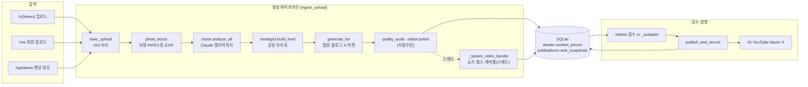

# Shopcast (올린다 · ollinda.kr) — 종합 분석 리포트

> 2026-07-11 · 코드 직접 분석(9개 병렬 에이전트: 프론트·백엔드·데이터·인프라 + BUG·ARCH·MARKETING·CONTENT·VIDEO).
> 대상: Python FastAPI 서버렌더 모놀리스 (~10,300 LOC, `app/main.py` 3,757줄 = 36%). 아키텍처 개요는 `ARCHITECTURE.md` 참고.
> 코드는 수정하지 않았습니다. 근거는 `파일:라인`으로 명시, 확정 못 한 것은 (추측) 표기.

---

## 1. 아키텍처 & 데이터 흐름

**핵심 관찰**: 파이프라인의 공유 상태가 구조화된 컨텍스트 객체가 아니라 **`asset.note` 문자열 이어붙이기**다(사진분석·브리프·성과학습이 전부 note에 누적, `ingest.py:53-65`). 진입점 3개 중 `/api/demo`만 **async 핸들러에서 동기 실행**(`main.py:229`)이라 데모 1건이 이벤트루프 전체를 멈춘다.

**발행 계층은 전략패턴이 실제로 작동**(`registry.py`, `adapters/base.py`의 `Publisher` ABC)하나, **생성·후처리·뷰 계층은 kind 문자열 if-elif가 파이프라인 전체에 누수**(§3.1 참고).

---

## 2. 🔴 발견된 버그 (심각도순)

| # | 심각도 | 위치 | 요약 | 수정방향 |
|---|--------|------|------|---------|
| B1 | **Critical** | `auth.py:15`, `oauth.py:32` | `SHOPCAST_SECRET` 미설정 시 `dev-secret-change-me`로 세션 서명 → 임의 uid 세션 위조로 오너 계정 탈취(HMAC 16자=64bit 절단도 약함) | 미설정 시 기동 실패(fail-closed), 서명 전체 길이, 세션 만료 포함 |
| B2 | **Critical(조건부)** | `main.py:111-137` | `SHOPCAST_ADMIN_PASS` 미설정 시 `/admin/*` 전면 공개 — `/admin/cleanup`(DB·스토리지 파괴), `/admin/testaccount`(임의 계정), 회원 이메일 유출 | 미설정 시 기동 거부 or destructive 라우트 차단 |
| B3 | **High** | `services/revise.py:85` | `gen._assemble(...)` 미존재 메서드 호출(`_assemble_legacy`만 있음) → 쇼츠 자막 변경 수정 시 무조건 AttributeError 500, 수정 유실 | `_assemble_legacy`로 교체 |
| B4 | **High** | `main.py:2577-2587` | Paddle 웹훅이 `custom_data.plan`(클라 조작 가능)을 신뢰 → 저가 결제로 상위 플랜 활성. 서명검증은 정상이나 priceId 대조 없음 | 웹훅 `items[].price.id`를 서버 `PADDLE_PRICE_*`와 매칭 |
| B5 | **High** | `adapters/instagram.py:56`, `youtube.py:44` | R2 미러 후 로컬 삭제(`ingest.py:208-213`)했는데 실발행은 `/asset/{id}`·`/video/{id}` 로컬 파일 의존 → 자동발행 404 실패. `SHOPCAST_BASE` 기본 localhost면 외부 접근 불가 | 발행 시 R2 공개 URL 사용 or 발행 완료까지 로컬 보존 |
| B6 | **Medium** | `db.py:353-359` | `incr_month_usage` SELECT→UPDATE 비원자적 → 동시 생성 시 월 사용량 lost-update(쿼터 우회) | `UPDATE ... SET month_used = month_used + ?` 원자적 증분 |
| B7 | **Medium** | `main.py:3406-3444` | 쿼터 검사(동기)와 차감(백그라운드, 성공 후) 분리 → 빠른 연속 업로드로 무료 2회 우회 | 사용량 선예약/원복 패턴 |
| B8 | **Medium** | `db.py:21-24` | SQLite WAL·busy_timeout 미설정 + 다중 백그라운드 스레드 동시 쓰기 → `database is locked` 산발 | `PRAGMA journal_mode=WAL; busy_timeout=5000` |
| B9 | **Medium** | `main.py:3410`, `219-223` | 업로드 크기·MIME 검증 전무, `await read()` 전량 메모리 로드 → 대용량 DoS·메모리 스파이크 | 사이즈 상한 + content-type 화이트리스트 |
| B10 | **Medium** | `main.py:2527-2552` | `/billing/success`(GET) 멱등성 없음 → 프리페치/새로고침 시 이중 청구 시도 | 주문 idempotency key |
| B11 | **Medium** | 모든 `set_cookie` | 세션 쿠키 `secure` 플래그 없음(httponly·samesite만) | HTTPS에서 `secure=True` |
| B12 | **Low** | `oauth.py:73-75` | X PKCE가 `method=plain` + SECRET에서 결정적 도출 → PKCE 보호 무력 | S256 + 랜덤 verifier 세션 저장 |
| B13 | **Low** | `main.py:3727-3735` | `/asset/{pid}` 소유권 검증 없음 — piece id로 원본 이미지 노출(uuid라 난이도만) | 소유권/서명 URL 체크 |
| B14 | **Low** | `auth.py:38-49` | 세션 타임스탬프 파싱만 하고 만료 미검증 → 토큰 영구 유효 | 만료 검사 추가 |
| B15 | **Low(추측)** | `text_claude.py:16,260` | 모델 `claude-opus-4-8` + `thinking={"type":"adaptive"}` 비표준 파라미터. 무효 시 `_call_llm` 예외를 `generate_for`(generate.py:19)가 삼켜 **빈 pieces**만 남음 → 키 있는데 결과 없으면 최우선 점검 | SDK/모델 유효성 확인, 파라미터 검증 |

**콘텐츠 품질 관련 버그(별도)**:
- **C1 해시태그 자기모순 루프**: `quality_audit`은 해시태그 >6개 감점(`seo.py:347`), 디렉티브는 3~5개인데 `editor.py:55`는 "8~12개", `revise.py:109`는 "8개 이상" → 저점수 캡션을 polish하면 오히려 재검수 감점 유발.
- **C2 리라이트 경로 가드레일 소실**: `revise.py`/`editor.py` 리라이트 프롬프트에 `FACTS_RULE`(가격 날조 금지)·PII 금지가 빠져 있음 → 1회 수정하면 정직성 가드가 프롬프트에서 사라지는 뒷문.
- **C3 법규 주의 누락**: 업종별 `cautions`(의료광고법·중고차 허위매물)가 캡션 프롬프트에만 주입되고 `industry_brief()`에 미포함 → 블로그·쇼츠·X·마켓엔 법규 주의 안 감(`industries.py:408-420`).
- **C4 autonomy=2 게이트 우회**: 완전자동은 85점 게이트를 건너뛰고 어댑터 형식검사만 통과하면 발행(`ingest.py:112-123`) → 과장어 있어도 자동 발행.

**영상 파이프라인 버그(별도)**:
- **V1 EXIF 회전(High급)**: `photo_boost.py:61`·`video.py:288` 둘 다 `ImageOps.exif_transpose()` 미호출(grep 0건) → 세로로 찍은 폰 사진이 90° 눕는다. 완성률 즉사 요인. 코드 2줄.
- **V2 HEIC 미지원(High급)**: `pillow-heif` 없음 → 아이폰 기본 포맷 업로드가 통째로 폴백(그라데이션 카드)으로 빠짐.
- **V3 레거시 폴백 자막 소실**: `_assemble_legacy`가 `subtitle` 파라미터를 받지만 미사용 → 씬 렌더 실패 시 만들어진 영상에 자막이 아예 없음(`video.py:754`).

---

## 3. 🟡 리팩토링/개선점 Top 10

| # | 대상 | 근거 | 효과 | 난이도 |
|---|------|------|------|--------|
| 1 | **main.py 갓파일 분해** — 라우트 91개 + HTML 빌더 + 결제 + 관리자 진단. `my_dashboard`(856~1200, ~345줄 단일함수), `_result_html`(~280줄). APIRouter로 me/admin/kit/billing 분리 | `main.py` 전체 | 상 | 중 |
| 2 | **Claude 호출 `app/llm.py`로 공용화** — `_call_llm`이 생성기 모듈에 있는데 9개 모듈이 역수입(`industries.py:498`, `strategist.py:68`, `editor.py:24`, `video.py:24`, `revise.py:13`, `place_news.py:37`, `adpack.py:62`, `x_text.py:10`). vision은 클라이언트 3회 별도 생성. 재시도·타임아웃·비용로깅·**프롬프트 캐싱**을 한 곳에 | 좌기 | 상 | 하 |
| 3 | **payload dict 타입화** — `video_path/reach/ranking_audit/brief/carousel_paths…` 10개+ 키를 여러 파일이 `.get()`으로 read/write, 오타·누락 silent. kind별 TypedDict/dataclass | `ingest.py`·`main.py`·`revise.py`·adapters | 상 | 중 |
| 4 | **프롬프트 헤더 조립 통합** — `[가게]/[사업형태]/페르소나/industry_brief/keywords/FACTS_RULE` 블록이 caption·blog·marketplace·x·video·revise에 각자 f-string 재조립. `PromptContext` 빌더 1개면 "전 생성기 적용"이 1곳 수정 | `text_claude.py:70`, `x_text.py:34`, `video.py:194` 등 | 중 | 중 |
| 5 | **ingest.py 오케스트레이터 비대화** — 보정~autopilot이 한 함수 사슬 + 침묵 `except: pass` 5곳(`ingest.py:46,66,96,185,214`). 단계 리스트 기반 파이프라인으로 | `ingest.py:17-215` | 상 | 중 |
| 6 | **미디어 서빙/ZIP/MIME맵 중복** — `demo_media`(352)와 `dl_media`(1763) 거의 동일, ZIP 2벌(`_write_zip`·`_zip_bytes`), MIME맵 3중 정의(`main.py:366,1775`,`storage.py:45`) | 좌기 | 중 | 하 |
| 7 | **HTML 스켈레톤 3벌** — `render.py`의 page/shell, `main.py:572/678`, `landing.py:50` — doctype+Tailwind 헤더 독립 3곳. Jinja2 도입 or 스켈레톤 단일화 | 좌기 | 상(유지보수) | 상 |
| 8 | **env 파싱 산재 / config 모듈 부재** — `os.environ.get` 85회, `SHOPCAST_STORAGE` 기본값 16곳 중복. `app/config.py` 단일화 | 좌기 | 중 | 하 |
| 9 | **침묵 예외 103곳(즉시 pass 27곳)** — R2·보정·캐러셀 실패가 전부 무음, 사용자는 "영상이 안 나와요"만. 최소 `logging.warning` 통일 | `grep except Exception` | 중 | 하 |
| 10 | **블로그 후처리 3중 구현** — 제목선택·마커보장·구매블록이 `text_claude.py:153`, `editor.py:41`, `revise.py:30`에 미묘히 다르게. revise는 FAQ/지도블록 보강 누락 | 좌기 | 중 | 중 |

**확장성 병목(사용자 증가 시 터질 순서)**:
1. **SQLite 단일 라이터** — WAL·busy_timeout·PRAGMA 전무, 인덱스 1개뿐. 업로드마다 스레드 2개가 `save_piece` 연타 → 동시 수십 명이면 `database is locked` 통계적 확실. → 근본은 Postgres(주석에도 명시).
2. **스레드 무제한 + `/api/demo` 이벤트루프 차단** — Semaphore/큐 0건, 업로드 N건 = ffmpeg N개 동시. `/api/demo`는 async라 데모 1건 도는 동안 사이트 전원 무응답.
3. **재시작 시 작업 소실** — job 테이블·재시도 없음, 진행 중 생성물 증발.
4. **로컬 디스크 의존 → 수평 확장 즉시 불가** — 단일 uvicorn 프로세스(워커 1).

---

## 4. 📈 마케팅 극대화 제안

**총평**: 생성 측 SEO(디렉티브·검수·CTA 분기)는 클레임대로 충실 — C-Rank/D.I.A(`seo.py:135`), 리텐션 훅(`seo.py:154`), X 링크 패널티 회피(코드로 URL 제거 `x_text.py:31`)가 실제 인코딩됨. **측정 측이 얇다** — 순위는 참고용 API 상위5 수동 스냅샷, 클릭은 카운터 1개, 도달은 하드코딩 추정.

**임팩트 大 (즉시)**
1. **추적링크를 콘텐츠 CTA에 자동 삽입 + UTM + 클릭 로그 행 단위화** — 클레임("내 손님 추적", `landing.py:266`) 대비 최대 실체 격차. 현재 `/r/{code}`는 `clicks` 단일 카운터(`db.py:70`), UTM 0건, 채널별 분리 없음 → 어트리뷰션 불가. `link_clicks(code,ts,referrer,ua)` 테이블 + 채널별 `?utm_source=` 링크 발급.
2. **순위 자동 스냅샷(일 1회 크론)** — 현재 사용자가 버튼 눌러야만 기록(`main.py:1239`)이라 "5위→2위⬆️" 스토리가 안 쌓임. 스케줄러로 tenant×키워드 일일 기록 → 학습 루프(`ingest.py:60`)·코칭 데이터 원천 확보.
3. **`editor.py:55` 해시태그 "8~12개"→"3~5개"** — 1줄로 리라이트 품질 저하 제거(C1).

**임팩트 中**
4. **발행 후 성과 회수** — IG Graph `insights`, YouTube Analytics로 views/saves 주기 수집 → `reach.py` 하드코딩 벤치마크를 실측 보정. "쓸수록 정밀화" 클레임 실체화.
5. **`publishAt` 데드코드 활성화** — YouTube 어댑터에 배선은 있으나(`youtube.py:54`) `payload["publish_at"]` setter 0건. 업종별 골든타임 테이블로 기본값 주입.
6. **검색량 조회 힌트에 지역 결합 + TTL 캐시** — `seo.py:105` 힌트가 `[업종명]`뿐이라 지역 롱테일 대신 전국 키워드 붙을 수 있음(추측). `[f"{reg} {ind}", ind]`로, `lru_cache`→시간 기반.
7. **X 링크는 첫 답글에** — 본문 링크 제거(구현됨)에 더해 "첫 답글에 링크" 문구를 결과 화면에 제공.

**실검색량 연동은 진짜로 배선됨** — `searchad.py`가 HMAC-SHA256 서명(`_sign`) + `/keywordstool` 실호출 + 500~5000 스윗스팟 로직. 단 키 없으면 규칙 기반으로 **조용히 다운그레이드**(사용자 표시 없음), 실검색량 키워드는 최대 2개만 보강(`seo.py:40`).

---

## 5. ✍️ 글 생성 개선 제안

프롬프트 밀도는 높음 — PAS/FAB/BAB(`seo.py:229-232`)·손실회피(`seo.py:220`)·훅 공식이 실제 텍스트로 존재, 채널 차별화도 길이·구조·플랫폼 정책 수준까지.

**P0 (버그 수정, 저비용)**
1. 해시태그 모순 수정 (C1) — `editor.py:55`, `revise.py:109`.
2. **`FACTS_RULE`+PII를 revise/editor 리라이트에 주입** (C2) — 한 줄 추가로 날조·PII 뒷문 차단.
3. **`cautions`를 `industry_brief()`에 포함** (C3) — 의료·중고차 법규 리스크 직결.
4. autonomy=2에도 최소 점수 게이트 + RISKY 히트 시 발행 보류 (C4).

**P1 (사실 검증 자동화)**
5. **숫자 그라운딩 체크** — `quality_audit`에 "출력의 금액·%·수치가 입력(note)에 존재하나" 정규식 대조 추가. LLM 0콜로 날조 가격을 기계적으로 잡는 유일한 방법(현재 사실검증은 100% 프롬프트 신뢰).
6. 의료·중고차 업종 전용 하드블록 금칙어("완치·부작용없음·완전무사고") 분리 — 현 `RISKY_EXPRESSIONS`는 감점만, 발행 차단 아님.

**P2 (전환율)**
7. **훅/제목 다변안을 출력으로** — 현재 "속으로 구상해"(`seo.py:211`)라 검증 불가. 블로그는 이미 제목 3안+`_pick_title` 자동선택 있음 → 캡션·X·쇼츠도 출력시켜 코드 선택 + A/B 자산화.
8. **구조화 출력(tool_use JSON schema) 전환** — `_parse_sections` 실패 시 raw 폴백으로 품질 저하가 조용히 발생(`text_claude.py:160`). 마커 후처리 상당수 불필요해짐.
9. 사회적 증거 명시 디렉티브 1줄 — 현재 유일하게 지시문 없는 핵심 설득 기법.

---

## 6. 🎬 영상 생성 개선 제안

파이프라인은 탄탄 — 씬별 TTS 실측 길이 기반 싱크(드리프트 없음), loudnorm -14 LUFS, 커버·진행바·다중 화면비. **단어 카라오케는 글자수 비례 근사**(`video.py:146`, forced alignment/타임스탬프 아님) — "씬 단위 싱크 O, 단어 단위 근사".

**즉시 (저비용·고효과)**
1. **EXIF 회전 수정** (V1) — `ImageOps.exif_transpose(im)` 2줄(`photo_boost.py:61`, `video.py:288`). 눕는 영상은 완성률 즉사.
2. **HEIC 지원** (V2) — `pillow-heif` + `register_heif_opener()`. 아이폰 업로드 폴백 방지.
3. **`-movflags +faststart` 추가** — `_mux`·`_aspect_variants` 모두 누락. moov가 끝에 있어 웹/R2 프로그레시브 재생 첫 지연 → 이탈. 플래그 1개.

**중기 (품질)**
4. **BGM 더킹** — 현재 상수 0.22 볼륨. `sidechaincompress`로 음성 구간 자동 감쇄 → 내레이션 명료도 급상승 + 무음 씬 펌핑 제거.
5. **단어 카라오케 실측화** — ElevenLabs `/with-timestamps`로 character-level 타임스탬프 → `_build_ass`만 교체.
6. **훅 첫 프레임에 실사진** — 현재 그라데이션 텍스트 카드(`_card_png`). 실사진 배경이 스크롤 정지력 높음(통설, 추측).
7. **씬 전환 xfade** — 현재 fade to black이라 씬마다 검은 플래시.
8. **최종 패스 화질** — `ultrafast`+CRF 미지정(기본 23) 2~3회 재인코딩. 최종만 `veryfast -crf 20`.
9. **운영 가시성** — ffmpeg 실패 stderr 로깅(현재 소실), 씬 탈락 카운트 표시, 렌더 동시성 Semaphore(2~3).

---

## 7. ⚡ 우선순위

### 🔥 지금 당장 고칠 것 5개 (보안·크래시·완성률 즉사 요인)
1. **B1 `SHOPCAST_SECRET` fail-closed** — 미설정 시 기동 실패 + 서명 전체 길이 (세션 위조 → 계정 탈취). `auth.py:15`, `oauth.py:32`
2. **B2 admin 인증 강제** — `SHOPCAST_ADMIN_PASS` 미설정 시 destructive 라우트 차단/기동 거부. `main.py:111`
3. **B3 `revise.py:85` `_assemble`→`_assemble_legacy`** — 쇼츠 수정 500 크래시 즉시 수정.
4. **V1 EXIF 회전 2줄 + B8 SQLite WAL 1줄** — 세로 영상 눕는 문제(완성률 즉사) + `database is locked` 최대 리스크 완화, 둘 다 초저비용.
5. **B4 Paddle priceId 검증 + B5 발행 미디어 R2 URL** — 매출 직결(플랜 우회) + 자동발행 404 방지.

### 📋 나중에 (구조 개선)
- 생성 워커 큐 + Semaphore + job 테이블(재시작 복구), `/api/demo` 이벤트루프 차단 제거
- `app/llm.py`·`app/config.py` 추출 → main.py 라우터 분리
- 추적링크 UTM·클릭 로그 행단위화 + 순위 자동 크론(마케팅 실측)
- payload TypedDict화, 프롬프트 `PromptContext` 통합, 사실검증(숫자 그라운딩)
- Postgres 전환 + 외부 워커(진짜 멀티인스턴스 시점)

---

### 방법론 주석
9개 에이전트가 코드를 직접 읽어 교차검증했습니다. `(추측)` 표기 항목(B15 모델 파라미터 유효성, V6 훅 실사진 효과, seo.py:105 지역 키워드 누수)은 코드만으로 확정 불가하여 별도 검증 필요.
